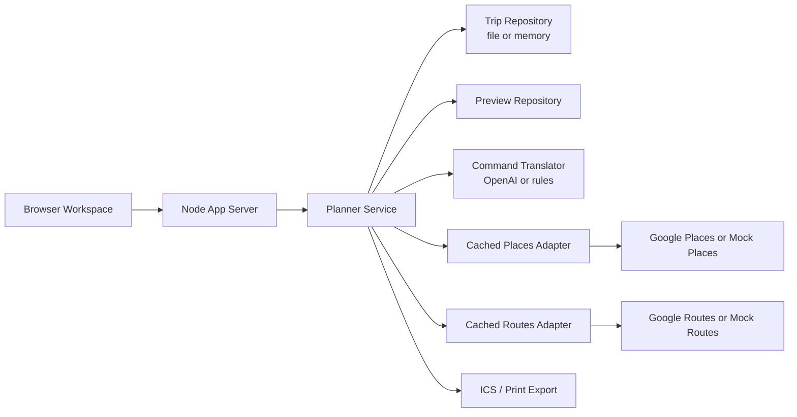

# Itinerary Workspace

AI-assisted travel planning workspace with a map, timeline, and natural-language itinerary edits.

This project explores a different UX from the usual one-shot trip generator. Instead of producing an itinerary once and freezing it, the app treats a trip as a shared editable workspace where every surface stays in sync:

- `Map` explains where the day moves spatially
- `Schedule` switches between `Timeline` and `Plan`
- `Selection` gives direct editing controls for the focused stop
- `Assistant` turns natural language into previewable itinerary mutations

The goal is simple: let AI help with travel planning without taking control away from the user.

## Screenshot


## Highlights

- interactive day-by-day itinerary workspace
- synchronized `Map`, `Timeline`, `Plan`, and `Selection` views
- direct edits for lock, unlock, move, reorder, and timeline drag
- preview / apply / reject flow for assistant-generated changes
- replace and insert places through search + diff previews
- route and opening-hours validation
- conflict repair previews for overlap, travel-time, meal-gap, and pacing issues
- multi-step undo / redo for direct edits
- `.ics` calendar export and print-friendly HTML export
- mock providers for fast local work and real Google + OpenAI integrations for live validation

## Why This Repo Exists

Most travel tools either:

- generate a static trip once
- optimize an itinerary behind the scenes
- or expose a form-heavy editor with little assistance

This repo is an attempt at a middle ground: an itinerary editor where AI can propose meaningful structural changes, but every change still goes through an explicit preview and the itinerary remains inspectable, editable, and deterministic.

## Product Model

One itinerary object is the source of truth for the whole app. That canonical state contains:

- trip metadata
- days and itinerary items
- places and routes
- conflicts and validation output
- markdown / text sections
- change history

From there, the app derives:

- map markers and route polylines
- timeline blocks
- plan rows
- conflict badges
- assistant diffs

Typical flow:

1. The user selects a day or stop.
2. The user edits directly or asks for a change in natural language.
3. The planner resolves the command into structured mutations.
4. The engine recomputes routes, gaps, and conflicts.
5. The same itinerary version re-renders the `Map`, `Schedule`, `Selection`, and `Assistant`.

## Architecture At A Glance



- `public/`: browser UI built as a lightweight workspace shell
- `server/app/`: HTTP server, runtime wiring, routes, and environment handling
- `server/planner/`: planner engine, derivations, command execution, export, and repositories
- `server/integrations/google/`: Google Places and Routes adapters
- `server/integrations/mock/`: fast mock adapters for local development
- `server/integrations/cache/`: in-process adapter caching
- `schemas/`: itinerary and planner command contracts
- `docs/`: design notes, architecture, API contracts, and engine docs

## Tech Stack

- Node.js 24+
- ESM app server
- vanilla web frontend in `public/`
- TypeScript planner modules shared across runtime layers
- Google Maps / Places / Routes integration
- OpenAI-based command translation with rule-based fallback
- file-backed local persistence for the current MVP

## Quick Start

### Requirements

- Node.js 24+
- no database required for the current MVP

### Run locally

```bash
cp .env.example .env.local
npm run dev
```

Open:

```text
http://localhost:3000
```

### Run tests

```bash
npm test
node --check public/app.js
```

## Runtime Modes

### Mock mode

Default local mode.

Uses:

- sample trip data
- mock Places adapter
- mock Routes adapter
- rule-based translator unless OpenAI is configured

This is the fastest way to iterate on workspace behavior.

### Real API mode

Uses:

- Google Places
- Google Routes
- OpenAI command translation

Useful for validating live search, routing, and natural-language mutation behavior.

Key environment variables:

```bash
GOOGLE_MAPS_API_KEY=your_server_key
GOOGLE_MAPS_BROWSER_API_KEY=your_browser_key
PLANNER_PROVIDER=google
OPENAI_API_KEY=your_openai_key
OPENAI_MODEL=gpt-4.1-mini
PLANNER_COMMAND_TRANSLATOR=openai
```

Additional storage, logging, and cache settings are documented in [.env.example](./.env.example).

## Example Assistant Requests

- `replace dinner with a better-rated American restaurant`
- `move the current stop 30 minutes later`
- `add lunch near the current route`
- `reoptimize the current day`
- `把当前这天的晚餐换成评分高一点的美式餐厅`

The important detail is that assistant requests are translated into structured planner commands before execution. The assistant never mutates the trip directly without going through the planner pipeline.

## API Shape

Main local routes:

- `GET /api/trips/:tripId`
- `GET /api/places/search`
- `POST /api/trips/:tripId/commands/preview`
- `POST /api/trips/:tripId/commands/execute`
- `POST /api/trips/:tripId/commands/apply`
- `POST /api/trips/:tripId/commands/reject`
- `GET /api/trips/:tripId/export/ics`
- `GET /trips/:tripId/print`

Optional debug routes:

- `POST /api/debug/reset`
- `GET /api/debug/runtime`
- `GET /api/debug/metrics`

## Repository Guide

- `public/index.html`, `public/app.js`, `public/app.css`: workspace UI
- `server/app/create-server.mjs`: server bootstrap
- `server/app/app-router.mjs`: route wiring
- `server/app/create-runtime.mjs`: runtime composition
- `server/planner/planner-service.ts`: orchestration entrypoint
- `server/planner/command-executor.ts`: mutation execution path
- `server/planner/derivations.ts`: recomputation and derived state
- `server/planner/export.ts`: calendar and printable exports
- `tests/`: runtime and planner coverage

## Design Docs

- [Itinerary workspace notes](./docs/itinerary-workspace.md)
- [Planner commands](./docs/planner-commands.md)
- [System architecture](./docs/system-architecture.md)
- [API contracts](./docs/api-contracts.md)
- [Frontend store](./docs/frontend-store.md)
- [Google adapters](./docs/google-adapters.md)
- [Planner engine](./docs/planner-engine.md)

Schemas and sample data:

- [Itinerary schema](./schemas/itinerary.schema.json)
- [Planner command schema](./schemas/planner-command.schema.json)
- [Sample itinerary](./examples/sample-itinerary.json)

## Current Status

This repo is still an MVP / prototype. The current implementation is strongest as:

- a product prototype for editable AI trip planning
- a reference implementation of previewable planner commands
- a playground for integrating places, routing, validation, and assistant-driven edits in one workspace

Known gaps:

- no auth or multi-user model yet
- file-backed persistence instead of a production database
- heuristic planner behavior instead of a full optimization solver
- provider usage still needs stronger cost controls and observability
- UI is functional but not yet production-polished

## License

This project is released under the MIT License. See [LICENSE](./LICENSE).
