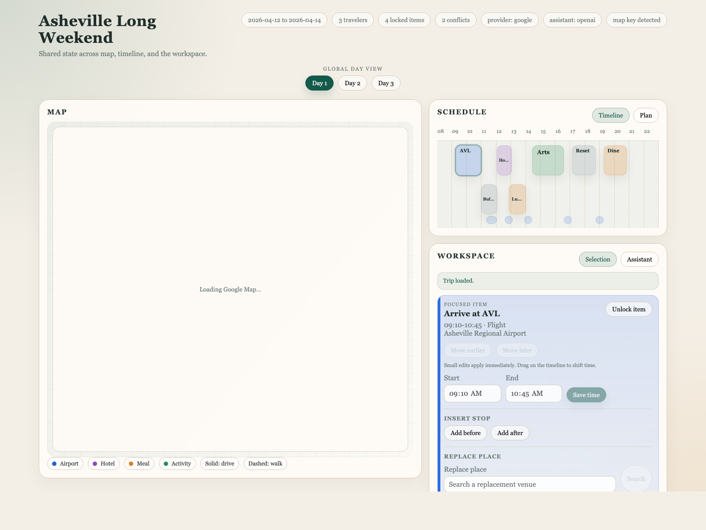

# Planner Workspace

Planner Workspace is an AI-assisted itinerary editor for travel planning.

Instead of generating a trip once and freezing it, this project treats a trip as a shared editable workspace. The same itinerary state drives every surface:

- `Map` explains where the day moves spatially
- `Schedule` switches between `Timeline` and `Plan`
- `Selection` gives direct item editing tools
- `Assistant` turns natural language into itinerary mutations

The product goal is simple: let AI generate and revise a realistic plan without taking control away from the user.

## Screenshots

### Workspace overview



## Current MVP

What works today:

- Global day switcher
- Interactive map with stop markers and route polylines
- Schedule panel with `Timeline / Plan` toggle
- Selection panel for focused editing
- Assistant preview / apply / reject flow
- Direct edits for small changes:
  - lock / unlock
  - move in time
  - reorder
  - timeline drag
- Single-step undo for direct edits
- Replace a place through search + preview
- Add a place before / after the selected item through search + preview
- Three-view synchronization:
  - click `Map`, `Timeline`, or `Plan`
  - the same item is focused everywhere
- Route and opening-hours validation
- Real provider support:
  - Google Places + Routes
  - OpenAI command translation

## UI Shape

The current layout is:

- Left: `Map`
- Right top: `Schedule`
- Right bottom: `Workspace`

`Schedule` contains:

- `Timeline`
- `Plan`

`Workspace` contains:

- `Selection`
- `Assistant`

This keeps the time-related views together while preserving a separate work area for editing and AI actions.

## How It Works

The system uses one itinerary object as the source of truth.

That state contains:

- trip metadata
- days and items
- places
- routes
- conflicts
- markdown / text sections
- change log

From there, the app derives:

- map markers and polylines
- timeline blocks
- plan rows
- conflict badges
- assistant diffs

Typical flow:

1. User selects a day.
2. User edits directly or asks the assistant for a change.
3. The planner resolves commands.
4. The engine recomputes routes, gaps, and conflicts.
5. `Map`, `Schedule`, and `Selection` all re-render from the same updated itinerary.

## Runtime Modes

### Mock mode

Default local mode.

Uses:

- sample trip data
- mock Places adapter
- mock Routes adapter
- rule-based translator unless OpenAI is configured

This is the fastest way to work on UI and planner behavior.

### Real API mode

Uses:

- Google Places
- Google Routes
- OpenAI command planner

This is useful for validating live place search, routing, and natural-language mutation behavior.

## Quick Start

### Requirements

- Node.js 24+
- no database required for the current MVP

### Run locally

```bash
npm run dev
```

Then open:

```text
http://localhost:3000
```

### Run tests

```bash
npm test
node --check public/app.js
```

## Environment Setup

The runtime reads environment values from shell env or `.env.local`.

An example file is included:

```bash
cp .env.example .env.local
```

### Google configuration

For real Google providers, use two different keys:

```bash
GOOGLE_MAPS_API_KEY=your_server_key
GOOGLE_MAPS_BROWSER_API_KEY=your_browser_key
PLANNER_PROVIDER=google
```

Notes:

- `GOOGLE_MAPS_API_KEY` is for server-side Places / Routes calls
- `GOOGLE_MAPS_BROWSER_API_KEY` is for the browser map only
- the browser key should be restricted by HTTP referrer
- the server key should be restricted by API and server environment
- the runtime no longer falls back from browser key to server key

If you only set the server key, Google Places / Routes can still run, but the browser map will not load live Google tiles.

### OpenAI configuration

```bash
OPENAI_API_KEY=your_openai_key
OPENAI_MODEL=gpt-4.1-mini
PLANNER_COMMAND_TRANSLATOR=openai
```

Notes:

- if `OPENAI_API_KEY` is present, the runtime can infer the OpenAI translator automatically
- if OpenAI fails, the system falls back to the rule-based translator

## Real API Validation

Smoke test Google adapters:

```bash
npm run test:google
```

Then run the app:

```bash
npm run dev
```

Useful live checks:

- provider pill shows `google`
- assistant provider shows `openai` when configured
- map loads live Google tiles when `GOOGLE_MAPS_BROWSER_API_KEY` is set
- assistant requests produce preview diffs against real providers

## Example Assistant Requests

- `把当前这天的晚餐换成评分高一点的美式餐厅`
- `锁定第一天的 River Arts District walk`
- `把第一天的 River Arts District walk 往后挪 30 分钟`
- `reoptimize the current day`
- `add lunch near the current route`

The important detail is that assistant requests are translated into structured planner commands before execution.

## API Shape

Main local API routes:

- `GET /api/trips/:tripId`
- `GET /api/places/search`
- `POST /api/trips/:tripId/commands/preview`
- `POST /api/trips/:tripId/commands/execute`
- `POST /api/trips/:tripId/commands/apply`
- `POST /api/trips/:tripId/commands/reject`
- `POST /api/debug/reset`
- `GET /api/debug/runtime`

There are two mutation paths:

1. `preview -> apply / reject`
   Use for AI changes and larger edits such as replace / insert.
2. `execute`
   Use for direct user edits such as lock, move, reorder, and undo.

## Repository Structure

### Frontend

- `public/index.html`
- `public/app.js`
- `public/app.css`

### App server

- `server/app/create-server.mjs`
- `server/app/dev-server.mjs`
- `server/app/app-router.mjs`
- `server/app/create-runtime.mjs`
- `server/app/runtime-config.mjs`

### Planner engine

- `server/planner/planner-service.ts`
- `server/planner/command-executor.ts`
- `server/planner/derivations.ts`
- `server/planner/diff.ts`
- `server/planner/types.ts`

### Translators

- `server/planner/openai-command-translator.ts`
- `server/planner/rule-based-command-translator.ts`
- `server/planner/fallback-command-translator.ts`

### Providers

- `server/integrations/google/`
- `server/integrations/mock/`

### Demo data

- `server/demo/sample-trip.ts`

### Tests

- `tests/`

Current automated coverage includes:

- app routing
- planner preview / apply / execute flows
- undo generation
- insert-before / insert-after behavior
- translator normalization
- sample trip baseline validity

## Current Limitations

This repo is still an MVP / prototype.

Known gaps:

- persistence is in-memory, not database-backed
- no auth or multi-user model
- planner optimization is heuristic, not a full solver
- Google and OpenAI usage still needs cost controls and stronger observability
- UI is functional but not yet production-polished

## Design Docs

Additional docs:

- `docs/itinerary-workspace.md`
- `docs/planner-commands.md`
- `docs/system-architecture.md`
- `docs/api-contracts.md`
- `docs/frontend-store.md`
- `docs/google-adapters.md`
- `docs/planner-engine.md`

Schemas and examples:

- `schemas/itinerary.schema.json`
- `schemas/planner-command.schema.json`
- `examples/sample-itinerary.json`

## License

This project is released under the MIT License. See [LICENSE](./LICENSE).
