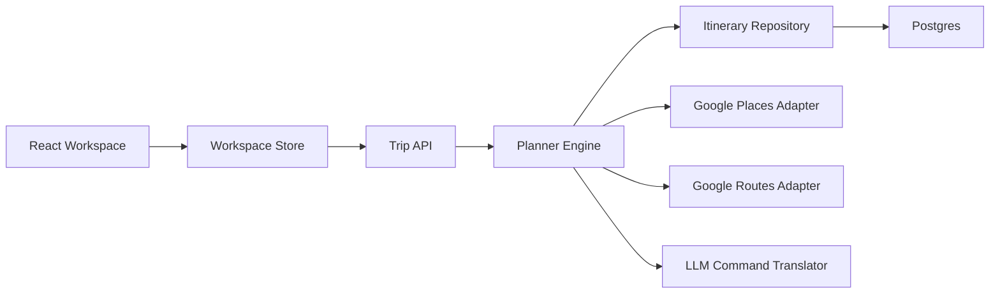

# System Architecture

## Goal

Turn the current wireframe and schemas into an implementation plan that can ship as a real MVP:

- one shared itinerary store
- one mutation pipeline for chat and quick actions
- one backend that owns validation and route recomputation
- one set of Google adapters for places and routes

## Recommended MVP Stack

Use a TypeScript-first web stack so the itinerary schema can stay shared across frontend and backend:

- Frontend: Next.js + React + TypeScript
- Styling: CSS variables plus component-local CSS or Tailwind if the team prefers utility styling
- Map rendering: Google Maps JavaScript API
- Client data fetching: TanStack Query
- Client local workspace state: Zustand
- API server: Next.js route handlers for MVP, with a planner service layer kept framework-agnostic
- Validation: Zod or generated runtime validators from the JSON schemas
- Persistence: Postgres
- Background jobs: lightweight queue only if route recomputation becomes slow; otherwise keep mutations synchronous in MVP

The key decision is not the exact framework. The key decision is keeping the planner engine independent from the UI framework so command execution is deterministic and testable.

## Runtime Modules



## Module Responsibilities

### React Workspace

- renders map, markdown, timeline, and assistant from one trip payload
- owns only UI state such as selection, panel mode, and preview visibility
- never computes authoritative route timings or opening-hour conflicts

### Workspace Store

- keeps the loaded itinerary and active preview draft
- exposes derived selectors for map overlays, timeline blocks, markdown sections, and unresolved conflicts
- applies optimistic UI only for local interactions like selection and panel toggles

### Trip API

- authenticates the user
- exposes trip load, command preview, command apply, and quick-action endpoints
- enforces `base_version` checks to prevent conflicting writes

### Planner Engine

- translates assistant intent into planner commands
- resolves place candidates and route legs
- recomputes schedule fields
- validates conflicts and lock constraints
- generates diff payloads for preview and final apply

### Itinerary Repository

- stores canonical authored state
- records change log entries and command audit history
- keeps derived artifacts either inline with the itinerary or in adjacent tables

### Google Adapters

- `Places Adapter`: place lookup, metadata hydration, opening hours, rating
- `Routes Adapter`: leg duration, distance, mode-specific path, polyline, step instructions

### LLM Command Translator

- converts free-form user chat into planner commands
- never applies mutations directly
- must emit structured commands plus confidence and ambiguity notes

## Core Request Paths

## Load Trip

1. Client requests trip workspace.
2. API loads the itinerary plus derived markdown and conflicts.
3. Store normalizes the payload and computes selectors.
4. All four panels render from the same versioned trip object.

## Preview Command

1. User enters chat or clicks a quick action.
2. Client posts `base_version + utterance or commands`.
3. Planner engine resolves places and routes on a working draft.
4. Engine returns command list, changed items, warnings, and a preview itinerary.
5. Client renders diff without mutating canonical local state.

## Apply Command

1. User accepts the preview.
2. Client posts the preview token or command list with the same `base_version`.
3. API persists the new itinerary version.
4. Store replaces canonical state and clears preview mode.

## Suggested Folder Layout

```text
app/
  trips/[tripId]/page.tsx
components/
  workspace/
  map/
  timeline/
  markdown/
  assistant/
lib/
  api/
  store/
  planner-client/
  schemas/
server/
  routes/
  planner/
  integrations/google/
  repository/
```

## Persistence Model

MVP can start with one canonical itinerary document per trip plus a few relational side tables:

- `trips`
- `trip_itineraries`
- `trip_change_log`
- `trip_command_runs`

This is enough to support versioning and auditability without prematurely splitting every itinerary item into its own table.

## Versioning Rule

Every write must include `base_version`.

- If `base_version` matches the latest trip version, apply the mutation.
- If it does not match, reject with `409 conflict` and force the client to reload or rebase preview state.

This matters because chat commands and quick-action buttons are effectively concurrent editors.

## Validation Boundaries

Keep these rules server-side only:

- opening hours feasibility
- lock violations
- overlap detection
- transport duration feasibility
- pace limits
- meal gap checks

Keep these rules client-side only:

- selected item
- panel focus
- expanded day
- unsaved chat input

## MVP Non-Goals

- collaborative live cursors
- offline mutation queues
- route caching strategy beyond simple response reuse
- advanced optimization across multiple cities

## Build Order

1. Shared TypeScript types generated from the existing schemas
2. Trip load endpoint and read-only workspace page
3. Client workspace store and selectors
4. Command preview/apply endpoints
5. Planner engine execution pipeline
6. Google adapters
7. Assistant chat translator
